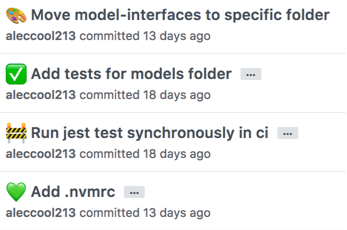
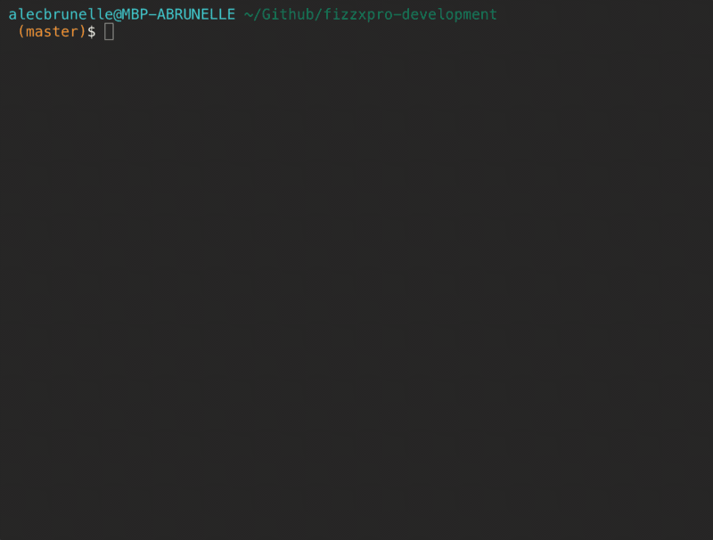
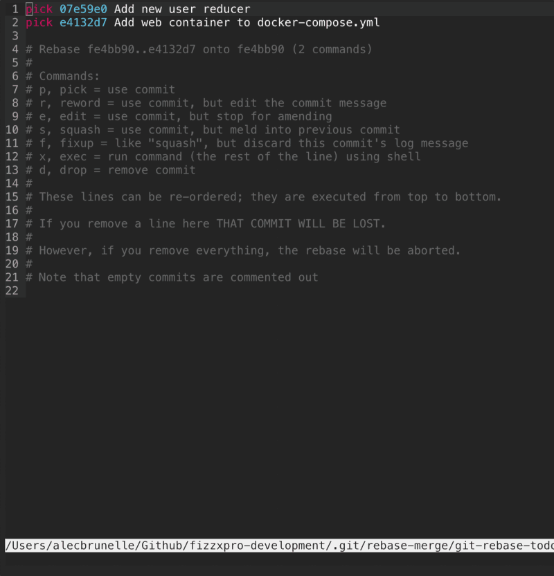

> Disclaimer: This is meant for people who are experienced in Git and know their way around the basics and want to bring their understanding to the next level.

Ever seen a Git history as clean as this?

<table class="image">
    <caption align="bottom">A clean Git history</caption>
    <tr><td></td></tr>
</table>

Probably not. Why? Developers are often too lazy (for good reason) and throw Git organization alongside `nice-to-haves` and `TODO` in terms of priorities. With this post, I’m going to make having an clean and easy-to-read history fast and easy!

Let's start by introducing you to some neat Git tricks which you can easily integrate into your workflow. These tips should help you understand Git not only when using the CLI but also GUI clients. These topics I never really saw in Git tutorials and have learned myself or over 🍻 with coworkers.

## Git Reset

Often you will find yourself in this situation:

<table class="image">
    <caption align="bottom">😕</caption>
    <tr><td></td></tr>
</table>

You just started working on a new branch, refactored a piece of code, installed a package, and wrote half of the necessary code for the feature.

6PM rolls around and you commit everything to save your progress.

<table class="image">
    <caption align="bottom">📝</caption>
    <tr><td></td></tr>
</table>

When you come back to the project, you realize, “Oh no! Putting this into separate commit will take so much time!”. Okay, so you might not be thinking that, but eh, you might be lazy like me.

<pre class="language-bash"> git reset HEAD~1 </pre>

git reset is your friend here. This will reset your current HEAD to the commit before your `wip` commit, but your working tree will be preserved to continue editing.

<table class="image">
    <caption align="bottom">⏲️</caption>
    <tr><td></td></tr>
</table>

> This is one of the many capabilities of this great command. I would recommend you research this more.

Awesome! Now we can start committing things which make sense.

<table class="image">
    <caption align="bottom">✍️</caption>
    <tr><td></td></tr>
</table>

> As far as Git naming conventions go, I recommend you read up on that as well.

Our commits are making more sense! Lets throw a 🔧 into things.

## Git Rebase

> [Lots of great reading](https://www.atlassian.com/git/tutorials/rewriting-history) on different Git Rebase techniques.

You made a small error in your file and need to make a quick change.

<table class="image">
    <caption align="bottom">✍️</caption>
    <tr><td></td></tr>
</table>

This change is so small we don’t feel like it deserves its own commit. So how do we get this change into an existing local commit?

<pre class="language-bash"> git stash; git rebase -i HEAD~<commit_history_depth> </pre>

This stashes our one-line change and brings us to the rebase edit screen. Lets go ahead and edit that commit we want to bring our change into.

<table class="image">
    <caption align="bottom">🕓</caption>
    <tr><td></td></tr>
</table>

<pre class="language-bash"> git stash pop; git add .; git rebase --continue </pre>

This will bring our change into the git index while we are editing and then add it to the current commit. Neat right?

### Bonus

S/O to two Git tools which recently made the cut into my workflow for being so functional and beautiful:

- Gitup is a nice and minimal tool which doesn’t try and do too many things. Its branch view, stash viewer and integrations are fantastic. Great open-source companion to a die-hard Git CLI user.
- gitmoji-cli makes it very easy to organize your commits visually. Not only does it make your commits organized by forcing you to categorize them, but EMOJI! 💸

> This piece originally was posted on my dead and lonely [medium blog](https://medium.com/@yourboybigal/acquiring-git-superpowers-f48bf7e504c7)
