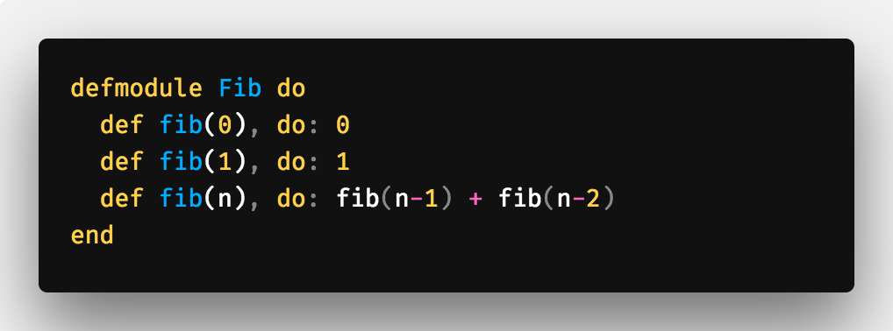
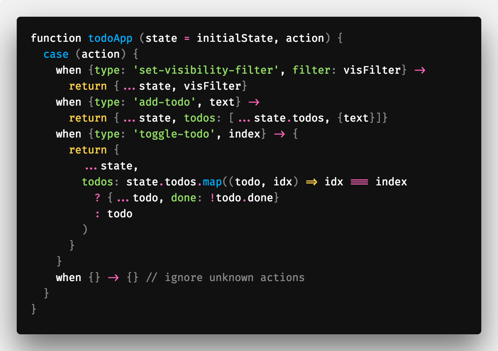
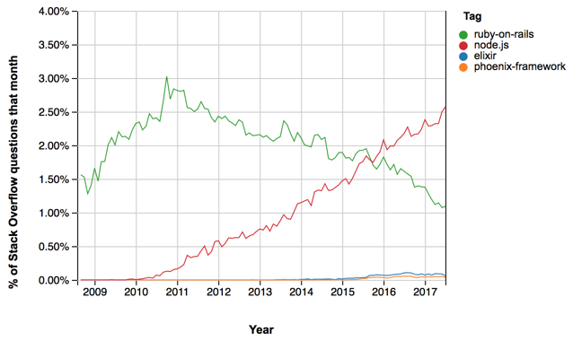

<table class="image">
   <caption align="bottom">Photo by Markus Spiske on Unsplash</caption>
   <tr><td></td></tr>
</table>

After getting comfortable with a couple programming technologies, developers usually stop there; your job and the systems you maintain may all be in one or two languages. You start using similar patterns again and again to solve the same problems. [Elixir](https://elixir-lang.org/), a relatively new programming language, opened my eyes to new techniques which broke this stagnant thinking.

Learning a new programming language can introduce you to techniques you never would've come across using your existing tech. It expands your toolbox when it comes to designing new systems. Imagine a carpenter being stuck to a certain set of tools for years, they would be limited in what they could build. After learning different programming languages for years, it was refreshing to step away from a mindset focused on getting work done as fast as I could. No timelines telling you what velocity to learn at and no peers depending on you to finish what you were working on. I find that in this relaxed setting, it's easier to digest larger cognitive loads.

These are some of the largest takeaways I had when learning the language:

- Elixir is syntax on top of Erlang, the battle-tested language built on top of the [BEAM VM](<https://en.wikipedia.org/wiki/BEAM_(Erlang_virtual_machine)>)

- The syntax is similar to Ruby so learning the syntax is easy and quick, especially for developers familiar with it

<table class="image">
   <caption align="bottom">E.g. of pattern matching. This and many other features of the language make it expressive and easy to read.</caption>
   <tr><td></td></tr>
</table>

- Did I mention it's FUNCTIONAL! Pure, functional programming IMO is worth the investment cognitively. <a href="https://medium.com/making-internets/functional-programming-elixir-pt-1-the-basics-bd3ce8d68f1b" target="_blank" >Here are some examples</a> of how Elixir utilizes it.

One of the benefits of learning a recently-created programming language is that it's built on top of existing best practices. This happens when the creators spend time thinking about what problems current developers face. "State management is hard", "it's hard to have zero time deployments of new code", "it's hard to maintain my systems", something every developer thinks. Elixir wants to make these problems less hairy and does so using functional methodologies wrapped around a VM which puts distributed and concurrent programming as a first-class citizen.
Elixir, for example, was built by developers who saw the productivity of the Ruby syntax, the maintainability of functional programming and the scalability of Erlang. These features of the language make it a compelling showcase of what a language recently built can be, as showcased in the pattern matching example above.

> Elixir, for example, was built by developers who saw the productivity of the Ruby syntax, the maintainability of functional programming and the scalability of Erlang.

### Wires connecting to wires

<table class="image">
   <caption align="bottom">OTP in the anime-flesh</caption>
   <tr><td></td></tr>
</table>

The rock solid foundation of Elixir is built on top of a library named <a href="https://en.wikipedia.org/wiki/Open_Telecom_Platform" target="_blank" >OTP</a>. OTP is an elegant way to handle all of the problems that arise in distributed programming, work across nodes, handling async messages, etc. It not only is a library of functions but also a paradigm to work within. This keeps things consistent across systems and large teams. Instead of a single process handling your entire app (e.g. Node.JS), many isolated processes make up an Elixir app. These processes communicate with each other using messages. This unlocks a lot of cool features, processes can now live across machines as messages can only be immutable, no pointers allowed.

The critic inside you will say the potential downfalls of using such a new language is that it isn't battle-tested. Usually, this is a valid criticism, such is not the case for Elixir. The VM Elixir it's built on top of is hella old. The initial open-source release of Erlang was in 1998, and Ericsson was using it in-house for a long time before that. Used by telecom networks, these were critical services which couldn't afford to have downtime. For example, that's how the very cool <a href="https://github.com/edeliver/edeliver" target="_blank" >hot-code-release</a> feature came to be which enabled developers to release new Erlang code without restarting servers.

### My Experience

<table class="image">
   <caption align="bottom" style="font-style:italic;">A candid photo of me reading Elixir in Action</caption>
   <tr><td></td></tr>
</table>

Last year, a coworker invited me to join his book club. "Let's learn this new language." I had heard that it was interesting so I said, "sure!". We would take a couple of hours every month to go over a chapter in the book, <a href="https://www.amazon.ca/gp/product/161729201X/ref=as_li_tl?ie=UTF8&camp=15121&creative=330641&creativeASIN=161729201X&linkCode=as2&tag=coffeedrive09-20&linkId=97d40dff77b7869475d6ee283c6501d2" target="_blank" style="font-style:italic;">Elixir in Action</a>. Initially, it was intimidating to join as I was vastly junior compared to the other members of the group but I gave it a shot. What followed was lots of great discussions and insight into topics I haven't dived into before. I am appreciating my former self for agreeing to join as not only did I learn a lot, I connected with coworkers in the company I would have never connected with otherwise. It helped me through our companie's adoption of Event Driven Systems (think Kafka) by exposing me to good practices when managing state between processes. Keeping processes small, pure and functional are sound engineering practices and are the pillars of how Elixir works. I didn't need anything to build immediately or an assignment to finish, I learned for the joy of learning and got a lot out of it.

### Common comments and questions

> My team is not going to be happy that after learning 3 Javascript frameworks in the past week, they have to learn this.

Once you start building things that have to scale or need to handle millions of requests, your on-call tickets increase. The reason for this is usually you can't predict traffic at that scale, push notifications go out for a new feature and everyone starts hitting your API. How do you handle this currently, with something like Node,JS or Ruby? You just increase your box numbers and then decrease them after the load is done. This gets expensive and developers should not just be throwing money at something to solve a problem. Erlang VM processes (different than the traditional process) are a fixed size, this is **mega**. To a degree, this essentially solves this problem. Knowing how much memory processes are, gives you god-like abilities. The VM can tell the server precisely how much memory it may potentially use. Instead of falling over and the box restarting, you could respond to the client with [HTTP Status Code 429](https://developer.mozilla.org/en-US/docs/Web/HTTP/Status/429) for example. No more unexpected memory loads at 1AM waking up developers!

> Okay, this is dope, how are errors handled?

Errors are a first class citizen in Elixir. Processes are small and isolated so when an error is thrown, the entire app process doesn't have to dump its stack, just the isolated process. When errors do happen, they are easy to debug as the process code is small (by convention). Every process gets a monitor (another OTP blessing), which can run some code when a process dies. An example monitor could restart the process for example so that it could accept more messages.

<table class="image" >
   <caption align="bottom">Everyone gets a monitor</caption>
   <tr><td style="text-align:center;"></td></tr>
</table>

Also, it's very neat that there is a [proposal](https://github.com/tc39/proposal-pattern-matching) for pattern matching in Javascript. Obvious proof that everyone is drinking the ... wait for it ... _Elixir_.

<table class="image">
   <caption align="bottom">🚒</caption>
   <tr><td></td></tr>
</table>

#### The road forward

I hope this introduction to some of the powers of Elixir encourages you to learn more. I just scratched the service of what is possible with the BEAM VM. I leave you with this graph showing Elixir's popularity on Stackoverflow compared to other popular languages:

<table class="image">
   <tr><td></td></tr>
</table>

The trend is upwards but it still has a long way to go for becoming somewhat mainstream.

Moving forward, I plan is just to write more and more Elixir code and get more comfortable with it. HackerRank has Elixir as an environment so it has been a great resource to practice the syntax. One of the next things I want to do is start creating something in [Phoenix](https://github.com/phoenixframework/phoenix).

Another resource I used in my learning journey was the <a href="https://www.meetup.com/TorontoElixir/" target="_blank">Elixir Toronto Meetup Group on Meetup</a>.

## Reading resources

The book we read during the book club was called Elixir In Action. A very good book which goes through the entire language and its features, in detail. The beginning is quite slow but as you start to wrap your brain around syntax, it soon becomes super interesting.

<a target="_blank" href="https://amzn.to/2Lt7BCP">
 <table class="image">
     <caption align="bottom" style="text-decoration:underline;">Elixir In Action (Amazon Affiliate Link)</caption>
     <tr><td></td></tr>
 </table>
</a>

This is another book I started which is much more approachable. It's a fun book which goes over the main features of why Elixir is a compelling language. This is a heart-pumper as it really just skims the surface.

<a target="_blank" href="https://amzn.to/2BWNsWC">
 <table class="image">
     <caption align="bottom" style="text-decoration:underline;">The Little Elixir & OTP Guidebook (Amazon Affiliate Link)</caption>
     <tr><td></td></tr>
 </table>
</a>
