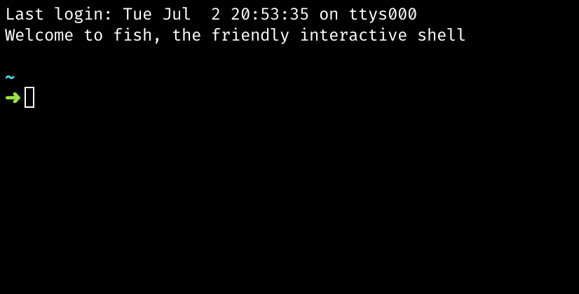
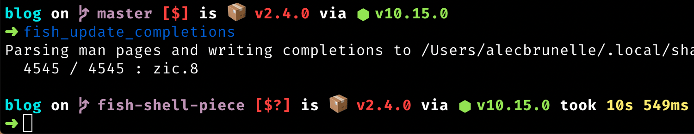

> This is part one of my [Beautiful Developer Tools series](http://blog.alec.coffee/beautiful-dev-tools/) where I focus on apps that I heavily use. They all help me remain calm 🧘‍♂️, collected 📚, and productive 🛠️ when writing code.

One of the most underrated features of any tool, in my opinion, is being fully-featured out of the box. No wasted time scouring the web for configurations other users have shared, the best plugins to use, or how to get that one integration working. This is one of the main reasons why I love the [Fish shell](https://fishshell.com) so much. Right from the start, you have a shell where you can become super productive and not do too much to get your favourite tools working. I've been using it every day for three years now so I thought I would share all of the best things about it.

## Built-in goodness

### Completes your sentences for you

Smart autosuggestions are seldom seen in terminals, let alone built-in. Instead of just beating the competition, the Fish team thought to demolish it. Using the history of your commands, it suggests commands which you can complete with the `right-arrow key`.

<table class="image">
  <caption align="bottom">Look ma! No Typing!</caption>
  <tr><td></td></tr>
</table>

You can also use `tab` to get all the options. Couple this with [npm-scripts-info](https://github.com/srph/npm-scripts-info) and you unlock god-like powers.

<table class="image">
  <caption align="bottom">All npm scripts for this package, with descriptions, IN THE TERMINAL WUT
</caption>
  <tr><td></td></tr>
</table>

This is because Fish knows how to parse CLI tool man pages in many different formats. Git, Docker CLI, package.json, you name it, most commands you try, it will have auto-completions for it.

### Never lets you down

My worst memories of bash come from the absence of this feature, syntax highlighting. You can notice it working in the above gif when `npm` is not complete yet, your current text is red, and turns blue when it's a valid command.

A simple thing which makes you think, "wow, now I am using a shell from the 90's"!

### -r no more

I have always been a fan of familiarity, and [wildcards](https://fishshell.com/docs/current/tutorial.html#tut_wildcards) are just that. You can use them in any command filter down the exact files you need with ease.

e.g.

    > ls *.jpg

## A tiny customization needed to go the extra mile

There aren't a lot of extra packages needed for Fish. Personally, I only use 2, which is wild because at one point I know my Oh-My-Zsh plugins were past 10.

### Oh My Fish

A homage to the great Oh My Zsh, `omf` is the most popular package manager for Fish. I use this to install just two packages, one for [nvm](https://github.com/derekstavis/plugin-nvm) and one for [spacefish](https://github.com/matchai/spacefish/).

### SpaceFish

Special mention to [Spacefish](https://github.com/matchai/spacefish/) for being the best shell prompt I have ever used. Support for showing:

- Current Git branch and rich repo status
- Current Node.js version, through nvm
- Package version, if there is a package in the current directory (package.json for example)

<table class="image">
  <caption align="bottom">Spacefish example
</caption>
  <tr><td></td></tr>
</table>

## Caveats

Not being POSIX compliant can scare some developers away. But really in my three years of usage (mostly Node.js, javascript, ruby, e.t.c.), I have not encountered any issues. Some commands I get from the internet which are Bash specific, I'll just `exit` and then come back to Fish when I finish. [This Stackoverflow post](https://stackoverflow.com/questions/48732986/why-how-fish-does-not-support-posix) goes into it more if you are so inclined.

Resources:

- [Fish Shell Website](https://fishshell.com/)
- [Try out the Fish Shell tutorial online](https://rootnroll.com/d/fish-shell/)
- [Oh My Fish Package Manager](https://github.com/oh-my-fish/oh-my-fish)
- [NVM wrapper plugin](https://github.com/derekstavis/plugin-nvm)
- [Spacefish Fish Shell Theme](https://github.com/matchai/spacefish/)
- [List of awesome Fish related software](https://github.com/jorgebucaran/awesome-fish)
- [Fisher, another package manager with a file-based extension config](https://github.com/jorgebucaran/fisher)
  - [A friends fishfile for fisher](https://github.com/elliottsj/dotfiles/blob/master/common/.config/fish/fishfilehttps://github.com/elliottsj/dotfiles/blob/master/common/.config/fish/fishfile)
- [Support Bash scripts in Fish](https://github.com/edc/bass)
