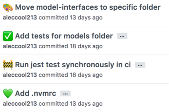
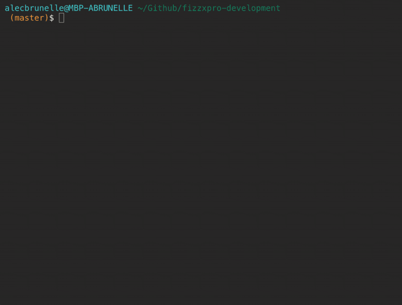

You should care about how clean your Git history is. It provides a way to communicate changes to a codebase with other developers who you are working with, but doing so requires some thought and intention. Ever seen one as clean as this?



Probably not. Why? Developers are often too lazy (for good reason) and throw Git organization alongside `nice-to-haves` and `TODO` in terms of priorities. With the power of `git reset` and `git rebase`, I’m going to show you that having a clean and easy-to-read history is fast and easy!

Let's start by introducing you to some Git tricks which you can easily integrate into your workflow. These tips should help you understand Git not only when using the CLI but also GUI clients. These topics I never saw in Git tutorials and have learned myself or from 🍻 with coworkers.

## The WIP workflow

Often you will find yourself in this situation:

<div class="Image__Small">
  
  <figcaption>😕</figcaption>
</div>

You just started working on a new branch, refactored a piece of code, installed a package, and wrote half of the necessary code for the feature.

6PM rolls around and you commit everything to save your progress.

<div class="Image__Small">
  
  <figcaption>📝</figcaption>
</div>

When you come back to the project, you realize, “Oh no! Putting this into separate commits will take so much time!”. Okay, so you may not be thinking that, but eh, your probably lazy like me.

```bash
git reset HEAD~1
```

`git reset` is your friend here. This will reset your current HEAD to the commit before your `wip` commit, but your working tree (all of your file changes) will be preserved to continue editing.

<div class="Image__Small">
  
  <figcaption>⏲️</figcaption>
</div>

> This is one of the many capabilities of this great command. I would recommend you <a href="https://www.atlassian.com/git/tutorials/undoing-changes/git-reset" target="_blank" >research</a> this more.

Awesome! Now we can start committing things individually to make some nice commits!

<div class="Image__Small">
  
  <figcaption>Did you know there are <a href="https://namingconvention.org/git/commit-message-naming.html" target="_blank">conventions</a> to commit messages?✍️</figcaption>
</div>

Our commits are now making more sense! Let's throw a 🔧 into things.

## Rewriting history... the right way

<!-- > [Lots of great reading](https://www.atlassian.com/git/tutorials/rewriting-history) on different Git Rebase techniques. -->

You've worked on a branch for a while, all of your commits are nice and organized, but then someone comments on an issue with the code that is back two commits 😱

You made a small error in your file and need to make a quick change.



This change is technically related to an old commit, so how do we go back in time and insert it there?

```bash
git stash; git rebase -i HEAD~insert_commit_history_depth
```

This stashes our one-line change for use later and brings us to the interactive rebase screen. Let's go ahead and edit that commit we want to bring the change into.

<div class="Image__Small">
  
  <figcaption>Just write `edit` on the commit you want to change 🕓</figcaption>
</div>

Now that we are editing the old commit, we need to bring our change back.

```bash
git stash pop; git add .; git rebase --continue
```

This will bring our change we stashed earlier into the git index, add it the commit we want to edit and then continue on.

And that's it! One thing to get even faster at doing this is aliasing these string of commands into shorthands.

### Shoutout to some kick-arse tools

S/O to two Git tools which recently made the cut into my workflow for being so functional and beautiful:

- <a href="https://gitup.co/" target="_blank">Gitup</a> is a nice and minimal tool which doesn’t try and do too many things. It's branch view, stash viewer and integrations are fantastic. Great open-source companion to a Git CLI user.
- <a href="https://github.com/carloscuesta/gitmoji-cli" target="_blank">gitmoji-cli</a> makes it very easy to organize your commits visually. Not only does it make your commits organized by forcing you to categorize them, but EMOJI! 💸
