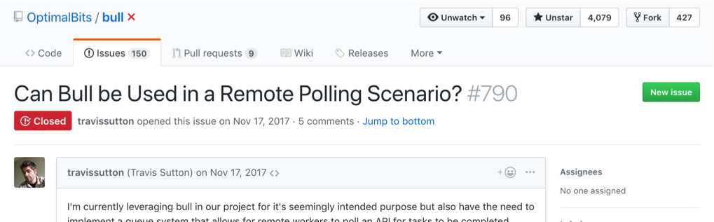

When switching to a micro-service oriented stack versus the ol' single monolith, new problems arise. The simple job processor of the past doesn't fit in this new architecture. We found Bull, a Node.js package, to cover our needs, but needed tweaks to work in this new world. Due to this module being open-source, I knew the improvements we made to it could be easily integrated into the main remote repo.

## Goals

Let's say we want do some specialized work, scanning an image to extract text for instance. This is a situation where a job queue could come in handy, this work is being done in the background, away from a user facing interface.

- Get image from user
- Queue job with image attached
- Job gets worked on
- Job results are sent back to app database

Two popular packages in the wild which could help you do the forementioned work are DelayedJob and Celery. These allow you to manage jobs with a fast key-store like Redis. These assume **the processing of the job and the job queue live in the same service**. If you have one service performing a task, e.g. the image processor, and another service which acts as a job queue, we cannot use these traditional constructs.

<div class="Image__Medium">
  
  <figcaption>This (Diagram 1)</figcaption>
</div>

versus

<div class="Image__Medium">
  
  <figcaption>This (Diagram 2)</figcaption>
</div>

## A Solution

Me and my coworkers found ourselves in this situation and when searching for answers, we found Bull might suffice. Keeping it 2018, this Node.js package is lightning fast, built to work with Redis and has an active community. It didn't quite fit our needs at first as it processed jobs in the same app as the queue-mechanism, see diagram 1. This is fine for traditional apps, but for our setup we needed to manage jobs across systems (see diagram 2). We needed to make this work in an async fashion where the worker may not be in the same repo or service as the service running Bull itself.

We need to think about how we want to manage a jobs life-cycle. Good thing someone contributed a diagram quite recently to the projects Github.

<div class="Image__Medium">
  
  <figcaption>Bull's Job Lifecycle <a href="https://github.com/OptimalBits/bull/blob/develop/docs/job-lifecycle.png" target="_blank">Diagram</a></figcaption>
</div>

Bull had a simple way to define the processing logic (refer to diagram 1), what a job does when in the `active` queue:

```javascript
queue.process(async () => {
  doWork();
});
```

This way, whenever a job came into a `waiting` queue, Bull knew how to process it and throw it to the `completed` queue. Right now, Bull managed all the state transitions on it's own, we need to switch to manual. You may be thinking, "to work in this new fashion, how about we just don't define this `process` method?", we tried this, and it _worked!_. Forward into the weeds we go.

> but for our setup we needed to manage jobs across systems

After digging into the code more, Bull defines state transition methods on two simple objects, `Job` and `Queue`.

After researching, the methods to do manual state transitions were private. It means that the authors didn't write these methods to be used publicly. This makes sense as Bull was never designed to do what we want to do with it. What do we need to do to make these public? After some more digging, we found someone else trying to do the same thing as us.

<div class="Image__Medium">
  
  <figcaption>he issue can be found <a href="https://github.com/OptimalBits/bull/issues/790" target="_blank">here.</a></figcaption>
</div>

Just using the private functions as is would have been fine but we are <a href="https://media.giphy.com/media/HoffxyN8ghVuw/giphy.gif" target="_blank">**professional developers.**</a>

> I would recommend that you write a few unit tests specifically for testing the code using the private functions... - @manast

The maintainer had a great suggestion, write unit tests for the private functions. The next best thing for this would be to at least write documentation for the functions so that they are understood by the community and strengthened their viability to be used publicly. And <a href="https://github.com/OptimalBits/bull/pull/1017/files#diff-d823dceb04482ab55e5004eebb53fc1cR182" target="_blank">that's what we did</a>.

## Open Source Bonus

For the actual pattern we described at the beginning (diagram 2), an addition to the reference docs <a href="https://github.com/OptimalBits/bull/pull/1017/files#diff-375fc823554b090375d9c47199cb5ee2R201" target="_blank">were added</a> to make this a viable pattern. Making this a known pattern encourages usage of the feature and possibly leads to other users finding issues when using in production. Typescript types were also available so we updated <a href="https://github.com/DefinitelyTyped/DefinitelyTyped/pull/27816" target="_blank">those</a> as well. After using it for some time (processing approx. 500k jobs), we found a bug and <a href="https://github.com/OptimalBits/bull/pull/1096" target="_blank">were able to easily fix it</a> using our extended knowledge of the package. Talk about bringing a third class feature to first class!

I am very happy with the outcome of the project as not only did we satisfy our requirements but also made open source contributions. This led to us understanding the packages internals and also led to us being able to easily add features for our use case. Having an active maintainer on the project who knew the ins and outside also made the entire process run smoothly.
