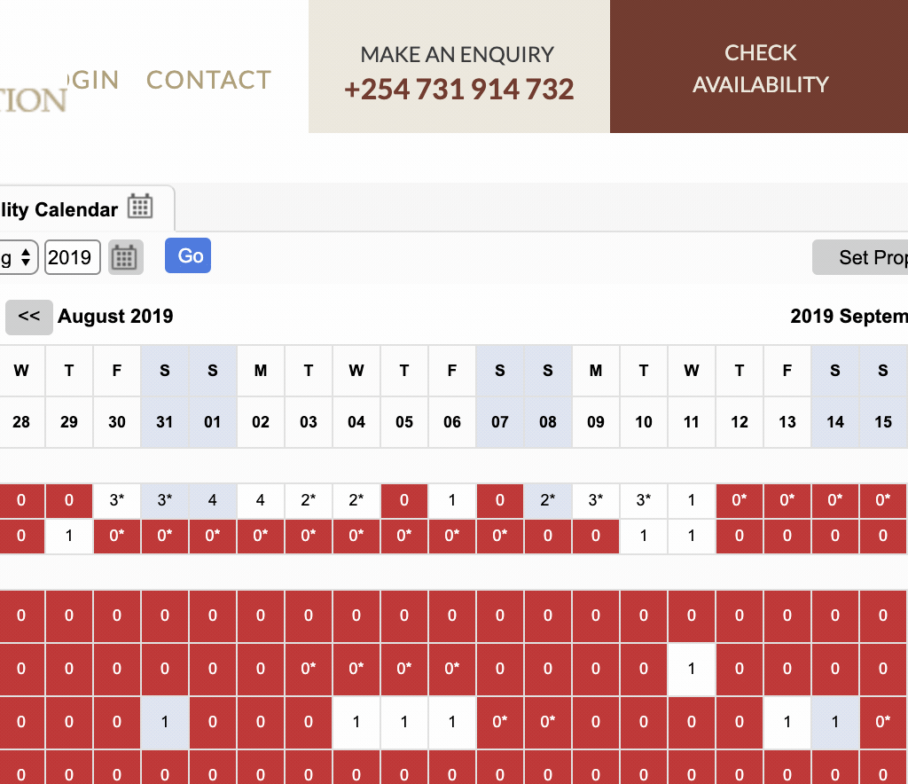

When my wife saw this post on Instagram, she was immediately hooked:

https://www.instagram.com/p/BvmFY7DgPyg

With our honeymoon in Kenya on the horizon, we set out to book a room. Consulting my aunt who had been to Kenya years ago, she stayed here and had no difficulties booking. It came to our surprise when we heard that this place was fully booked a **year or two in advance**.

The sudden popularity had to stem from something. A little researched showed this place being recently _Ellen’ed_.

https://www.instagram.com/p/BjQFBIDhsH_

Damn it, Ellen.

Initially, we checked their website to see if the dates we would be in Kenya were available, no luck. We then emailed the manor and again, no beauno, we were told we were put on their “waitlist”. Likely competing with other people on the waitlist, and our trip only being a few months away, me and my wife's hopes drew thin.

### The search for solutions

The website they were using to show availability was read-only, no functionality to book rooms.



Calling and email were the only way to reach them, a slow and arduous process. I assumed that when a date became free, their website would update _first_ and _then_ they would start contacting waitlist members. This way, they would still get bookings if people fell through.

### Assumptions

What I assumed next is that if we were to contact them the day the room became available, likely we would bypass the waitlist. But checking the website every hour was not going to fun.

I put my programmer pants on and thought that this would be a good use case for a good-ol web-scrapper, _jazz hands_. Hit the site every 30 min and SMS both my phone and my wife’s so that we could give them a call. Unlikely that this 1990's Kenyan website had protection against bots.

What looked like a simple table turned out to be a simple table:

```html
// Example of a unbooked day HTML node

<td
  width="25"
  unselectable="on"
  ab="0"
  style="border-top: none; "
  name="WB15:Salas Camp:Keekorok Honeymoon
  Tent-Tent 1:0*:1:11e8485f8b9898cc8de0ac1f6b165406:0"
  id="WB15:07:28:2019"
  darkness="0"
  onmousedown="mouseDownFunction(arguments[0]);"
  onmouseup="cMouseUp(arguments[0]);"
  onmouseover="mouseOverFunction(arguments[0]);"
  class="overbooking calIndicator0"
>
  1
</td>
```

This is what I needed to find, if it the node text was `1`, it was available.

After investigating the simple html structure, I started writing the Node.js service to scrap it. I stumbled upon an NPM module, <a href="https://www.npmjs.com/package/crawler" target="_blank">crawler</a>, which gave me all I needed out of the box.

```javascript
const Crawler = require("crawler");

const startCrawler = async () => {
  return new Promise(resolve => {
    const c = new Crawler({
      maxConnections: 10,
      callback: (error, res, done) => {
        if (error) {
          console.log(error);
          throw new Error(
            `Error with sending request to website! ${JSON.stringify(error)}`
          );
        }
        const $ = res.$;
        // get the table of bookings
        const results = $("#tblCalendar tbody tr").slice(12, 17);
        done();
        // return the results
        resolve(results);
      }
    });
    // hit giraffe manors website
    c.queue(
      "http://thesafaricollection.resrequest.com/reservation.php?20+2019-02-08" +
        "+RS12:RS14:RS16:WB656:RS2274+15:20:30:25++WB5++n/a++true+true+0+0"
    );
  });
};
```

This took a bit of debugging but now I had the HTML from Giraffe Manors website to play around with.

Next up, I went searching through the results with an NPM package called <a href="https://www.npmjs.com/package/cheerio" target="_blank">cheerio</a>.

```javascript
const parseResults = async () => {
  let availability = false;

  // get HMTL
  const results = await startCrawler();

  for (let x = 0; x < results.length; x++) {
    // Feb 13th - Feb 20th
    const validDates = cheerio(results[x]).find("td").slice(7, 14);
    // See if any of the dates are not booked
    for (let y = 0; y < validDates.length; y++) {
      if (parseInt(validDates[y].children[0].data, 10) === 1) {
        availability = true;
      }
    }
  }
  ...
```

Now comes the interesting part, SMS text my wife when the room show as available. I used <a href="https://www.twilio.com/" target="_blank">Twilio</a> for this but many other services exist. This required setting up a free account, I know I wouldn't be sending more than a few SMS messages.

```javascript
  ...
  // send text message if availability
  if (availability) {
    // Your Account Sid and Auth Token from twilio.com/console
    const accountSid = process.env.ACCOUND_SID;
    const authToken = process.env.AUTH_TOKEN;
    const twilio = require("twilio");
    const client = twilio(accountSid, authToken);

    client.messages
      .create({
        body: "Giraffe manor is available for our dates!",
        from: process.env.SMS_FROM,
        to: process.env.SMS_TO
      })
      .then(message => console.log(`Sent a text! ${message.sid}`))
      .done();
    return;
  }
  console.log("No availability!");
}
```

After testing with a few dates that were unbooked, it worked! Now to schedule it to run every 5 minutes (because why not?).

```javascript
const schedule = require("node-schedule");

schedule.scheduleJob("*/5 * * * *", () => {
  console.log("Running availability checker!");
  try {
    main();
  } catch (e) {
    console.log(`Error! ${JSON.stringify(e)}`);
  }
});
```

To host and run the code, I chose <a href="https://www.heroku.com" target="_blank">Heroku</a> as I have experience with it and knew the free tier would work for what I needed. I have no idea how their free tier supports background service jobs but anyways.

A couple of weeks later, (I actually forgot it was running), my wife received the text to her phone! We called them immediately and got it! Seemingly bypassing the waitlist, just like we had hoped. She got a barrage of texts and used up my free tier on Twilio as I didn't write a stop method when it found an available room 🤣

I particularly liked doing this because it's not often I code to solve a problem in my life but I thought it would be worth it for pictures like this:


This was one example of how I used my programming skills for a "real" world problem. I would love to hear a problem you may have solved, comment here.

Here is <a href="https://github.com/aleccool213/giraffe-manor-ping" target="_blank">the code</a> if you want to take a peek 👀
