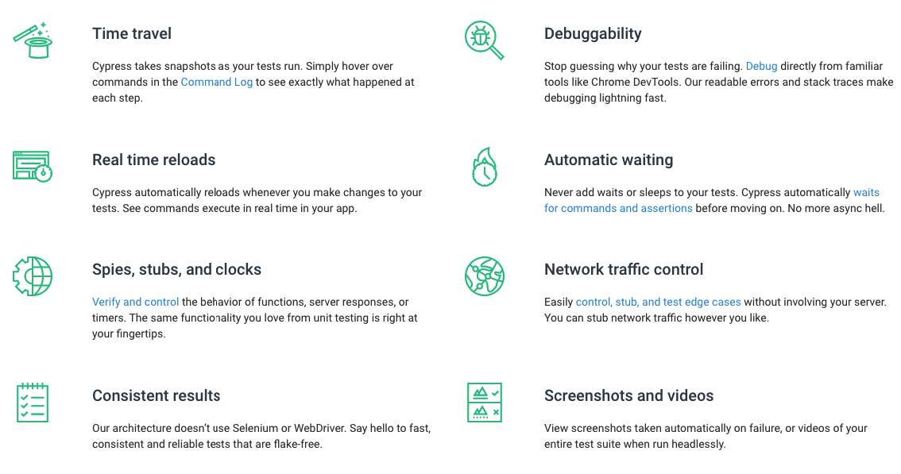
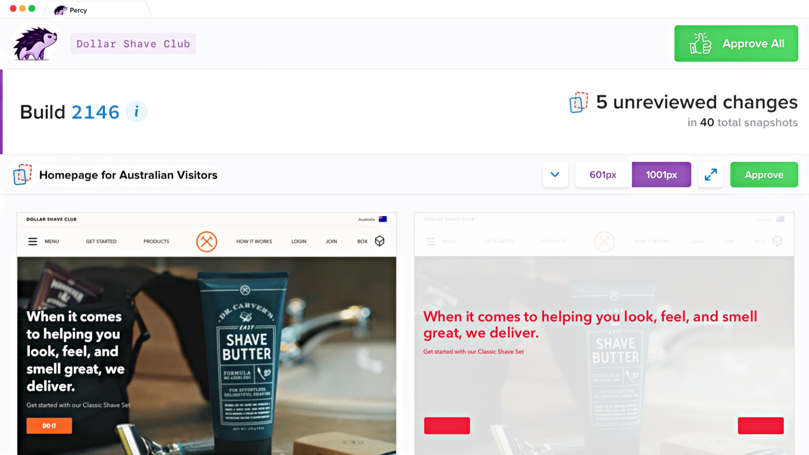

In software development, the faster you move, the more things break. As a codebase grows larger and larger, its pieces become more and more complex, every line adding a potential bug. The best organizations keep a handle on this through rigorous amounts of testing. Manual testing requires a lot of effort, that's where automated testing comes in. One of the hot frameworks on the scene is [Cypress](https://www.cypress.io/), a complete end-to-end testing solution.

In the past, web-app end-to-end testing has been a tricky beast. [Selenium](https://www.npmjs.com/package/selenium-webdriver) has been the main solution for quite some time and has a huge history. It has great browser compatibility but having your tests be consistent is difficult because it wasn't designed for app testing. That's why I got so excited when I heard about Cypress, promising to fix all of the old and broken ways of past frameworks. After writing and reviewing close to 200 test scenarios in the past year (that's with a small team), I wanted to write about what I wish I knew when I started and share my thoughts on my journey with Cypress thus far.

## What's in the box



End-to-end testing has always been a fragmented experience. You need to bring a lot of your own tools, for example, a test runner, an assertion library, and maybe other things like mocks. With Cypress, it packages all of those things together, this makes set up and configuration, dead simple. Not only that, the documentation is some of the best I have ever read in my career, with [guides on everything](https://docs.cypress.io/guides/guides/command-line.html#Installation) you are likely to encounter. Not only do they do a great job telling you how to use the product, but have in-depth explanations on the [architecture](https://docs.cypress.io/guides/overview/key-differences.html#Architecture), [flakey tests](https://docs.cypress.io/guides/overview/key-differences.html#Flake-resistant) and [best practices](https://docs.cypress.io/guides/references/best-practices.html).

## Prototyping

`vimeo: 379033499`

<iframe src="https://player.vimeo.com/video/379033499" width="640" height="360" frameborder="0" allow="autoplay; fullscreen" allowfullscreen></iframe>
<p><a href="https://vimeo.com/379033499">Simple Cypress Test Recording</a> from <a href="https://vimeo.com/user99821920">Alec Brunelle</a> on <a href="https://vimeo.com">Vimeo</a>.</p>

If you have the chance, before adopting anything of this scale, I always think it's a good idea to test it on a small project first, just to get a feel. Before advocating for it, I added it to my personal blog, just to see how the experience was.

A very simple scenario:

- Load up the app
- Go to the index page
- Click the first blog post link
- Assert content shows up

I was blown away with how fast it took me, under an hour. This was really as simple as [writing a few lines of Javascript for the test itself](https://github.com/aleccool213/blog/blob/eb20d81a1bd10ba6037d5ac26ee5142ce951d7df/cypress/integration/home_page_spec.js#L8), [the npm script in the package.json](https://github.com/aleccool213/blog/blob/60aa908e27aa83a539e563498b34f71a93167ec6/package.json#L70), and [running it in CircleCI](https://github.com/aleccool213/blog/blob/8fa71b2486660e0175ee49cea1559112a224f146/circle.yml#L39). Not only did Cypress perform the assertions but also it was recording videos! This could have been an even faster setup if I used the [CircleCi Cypress Orb](https://github.com/cypress-io/circleci-orb).

This got me a huge amount of test coverage in very little time. This proof of concept was more than enough to convince my team that Cypress was the right choice when it came time to start writing end-to-end automated tests.

## Decisions and Tradeoffs


The browser-based products we have at [Yolk](https://www.yolk.ai/) are completely separated from the server-side API's they fetch data from, they build and are served separately. This presents a few ways forward when deciding to write end-to-end tests. You can either deploy your backend with your frontend and test as if the app is in production or completely mock out API responses. Using a real backend means spinning up potentially memory-intensive processes when running on CI but you get the assurance that apps are near-production. With mocking your API responses, you test less of your stack, risk stubbing out non-realistic responses, and have to worry about the extra maintenance of keeping them up-to-date.

We decided on deploying live instances of the backends related to the app we were testing. This decision was easy for us to make due to already having a CLI tool to do much of the hard work. This tool (aptly named yolk-cli) downloads the latest docker images for apps and knows how to spin up products with minimal configuration. This made getting the real APIs working on CI not too huge of a task.

> Turns out, running two or three large python apps and a few [Next.js](https://nextjs.org/) servers on CircleCI does crap out the memory limit pretty fast. We reached out to CircleCI and they gave us access to their large resource classes (up to 16gb of RAM), score!

## Seeding Data


The next challenge we faced was seeding data. Your test scenarios must share as little state as possible with each other. This is a testing fundamental and [Cypress addresses it](https://docs.cypress.io/guides/references/best-practices.html#Having-tests-rely-on-the-state-of-previous-tests) in their guides. Having test scenarios data-independent goes a long way when debugging why things are going wrong. On the flip side, having all of your data be created through the UI will make for slow tests, there is a balance. This will be highly customized to how your app works but I will go into what worked for us.

Going back to our cli tool once again, it had a few commands which seeded some basic data. The commands looked like this:

```bash
yolk seed-articles
```

```bash
yolk seed-bots
```

Getting your feet off the ground with data that is basic to your app, static data or very high-level entities, for example, will speed up this process and will be easy to run on each CI build.

The next part will be seeding data for entities that may be more specific to individual tests. This is where things get contested, there is no silver bullet for this. We decided to call the APIs directly for these situations and use [Cypress custom commands](https://docs.cypress.io/api/cypress-api/custom-commands.html#Syntax) to initiate these requests. This was a decent choice because we are using GraphQL; the custom commands that use the API were easy to write and document.

```typescript
declare global {
  namespace Cypress {
    interface Chainable<Subject> {
      createFooBar: () => Chainable<string>;
    }
  }
}

/**
 * Creates a foo and returns a bar.
 */
Cypress.Commands.add("createFooBar", () => {
  cy.getCookie("token").then((token: any) => {
    return graphQLClient
      .request(print(CREATE_FOO), {
        token: token.value,
        fooName: "IAM A FOO",
        input: {}
      })
      .then(results => {
        return results.mutator.createFoo.bar;
      });
  });
});
```

Writing custom commands for actions which your tests will be performing over and over are a great way to consolidate all code, not just data seeders!

## Writing Scenarios with Gherkin


If you have written end-to-end tests before, you may be familiar with Gherkin syntax, used by Cucumber. This is an expressive, English-like way to write test scenarios. It can help with documenting your features and non-developers can contribute to writing test cases. We found [a way to integrate this file syntax into Cypress using a plugin](https://github.com/TheBrainFamily/cypress-cucumber-preprocessor).

```typescript
Feature: Searching on DuckDuckGo
  As a web surfer, I want to search DuckDuckGo, so that I can learn new things.

  Background:
    Given I am on DuckDuckGos website

  Scenario: Simple DuckDuckGo search
    When the search phrase "panda" is entered
    Then results for "panda" are shown
```

After writing these commands, the plugin will then go to Cypress to actually run the implementations:

```typescript
import { Given } from 'cypress-cucumber-preprocessor/steps';

Given('I am on DuckDuckGos website', () => {
  cy.visit('https://duckduckgo.com');
});

When('the search phrase "panda" is entered', () => {
  ...
});

When('results for "panda" are shown', () => {
  ...
});
```

## Asserting Elements and Best Practices


When it comes down to it, end-to-end testing is just making sure elements on the page have the correct content. When writing Cypress tests, 90% of the time you will need to be selecting elements and peering inside them. Cypress has a standard [get()](https://docs.cypress.io/api/commands/get.html#Syntax) command which exposes a JQuery-like selector to you, this should be familiar to those who have worked with Selenium. The problem with this selector is that it can be used incorrectly and you can't enforce (with code) it's usage. Welcome [cypress-testing-library](https://github.com/testing-library/cypress-testing-library), a wonderful tool maintained by a great testing advocate in the community, [Kent C. Dodds](https://kentcdodds.com/).

This plugin exposes a myriad of commands prefixed with `find` which work similarly to how `get()` does in native Cypress. All of these commands make for selectors [that are resilient to change](https://kentcdodds.com/blog/making-your-ui-tests-resilient-to-change). This can have a dramatic effect on how your tests stay consistent as your application progresses.

## Debugging


If you have ever worked with Selenium before, you know that debugging end-to-end tests can be somewhat of a nightmare. With Cypress, this pain is at an all-time low. Being a focus of the core product, being able to debug is one of the more pleasant experiences in your Cypress journey. Like for most things, [they have a great guide to get you started](https://on.cypress.io/plugins-guide).

Most of the things they have mentioned are great but the case which you will likely run into the most is a selector being incorrect. For this type of scenario, the GUI is a great way to find out what is going wrong. [There is a nice video explaining how to write your first test](https://vimeo.com/237115455) and it shows the GUI in action.

## Visual Testing and Catching Regressions



Another critical part of end-to-end testing will be how things look. HTML and CSS play a huge part in how your application will look like in different scenarios. Cypress can give you a lot of coverage in terms of how your app works but starts to break down when you want to assert its looks. Especially when it comes to browser compatibility and the different screen sizes your application is used in, visual regressions are hard to catch without proper implementation of [Visual Snapshot Testing](https://blog.hichroma.com/visual-testing-the-pragmatic-way-to-test-uis-18c8da617ecf).

The solution we ended up with was [Percy](https://percy.io/) as it integrates nicely with Cypress and [Storybook](https://storybook.js.org/). What it can do is take the current HTML and CSS which is being rendered in your Cypress test scenario and send it over to Percy's servers. Percy then renders the markup on its own internal browsers, with Chrome and Firefox being options. Percy knows which feature branch your Cypress test is being run in and compares this with your configured base branch. This can give you great confidence in pull requests when you don't know if code is changing the look of a certain component in your application. This can be a big time-saver if you have a lot of code in your Cypress tests that assert css values or how things should look.

Hot Tip: You can have Cypress take snapshots locally and then with Percy only when it's enabled by creating a new `takeSnapshot` custom command:

```typescript
/**
 * Takes a snapshot of the application at the moment this method is called.
 *
 * When running in headless mode, it takes a snapshot with Percy, which is
 * useful for testing purposes when integrated with our CI process.
 *
 * When running in headed mode, it takes a Cypress screenshot instead,
 * which is more useful for allowing a developer to see a preview.
 *
 * @param description A string that describes the snapshot.
 */
export const takeSnapshot = (description?: string) => {
  if (Cypress.browser.isHeaded) {
    return cy.screenshot();
  }
  return cy.percySnapshot(description);
};
```

## Parallel Builds and the Cypress Dashboard


Once test runs start to become long enough, you will start looking for other strategies to speed them up. Parallelization is something that can be performed due to Cypress running feature scenario files with a clean state each time they are run. You can decide on your own balance strategy, how your tests can be broken up, but the hosted version of [Cypress Dashboard](https://docs.cypress.io/faq/questions/dashboard-faq.html#What-is-the-Dashboard) provides a way to do this automatically.

Let's say I can afford to have three CircleCI containers to run my Cypress tests. First, I define the `parallelism: 3` in [my CircleCI job step config](https://circleci.com/docs/2.0/parallelism-faster-jobs/). What this will do is spin up three instances of your job, all with different job ids. Pass those ids off to Cypress, and you are off to the races. If you have Cypress Dashboard set up correctly, that service will tell your container which tests it should run. Here is an example of the config:

```typescript
cypress-my-app:
    working_directory: '~/Development/myapp'
    parallelism: 3
    steps:
      - run:
          name: 'Run cypress tests'
          command: |
              cypress run --record -- --parallel --group $CIRCLE_JOB --ci-build-id $CIRCLE_WORKFLOW_ID
```

> The super neat thing about this is that Cypress Dashboard knows your past test history and their speeds. It will use this knowledge to optimize your parallel builds by making sure the containers get a balanced load of tests to run!

Don't worry if this doesn't make much sense to you, [Cypress has answered how to do this](https://docs.cypress.io/faq/questions/dashboard-faq.html#My-CI-setup-is-based-on-Docker-but-is-very-custom-How-can-I-load-balance-my-test-runs).

## Browser Support


Unfortunately, if your organization needs to have support for IE11, you are out of luck. [The Cypress team has explicitly said they won't be supporting it](https://github.com/cypress-io/cypress/issues/310#issuecomment-337349727). [There is an incredible thread on Github](https://github.com/cypress-io/cypress/issues/310) that I really hope you read through. It goes into why they are rolling this out slowly and didn't choose WebDriver from the beginning and wrote their own custom driver.

For us at Yolk, we needed IE11 support for a couple of our applications. We kept getting regressions within IE11 and needed more comprehensive test coverage. We decided to use [Browserstack Automate](https://www.browserstack.com/automate) and Selenium to cover these apps. For CI, we already had the app built and running in Cypress, we just needed to add a new build step that ran these tests using the [Browserstack Local Proxy](https://github.com/browserstack/browserstack-local-nodejs).

For the tests themselves, we decided to integrate Selenium with [Cucumber](https://github.com/cucumber/cucumber-js), a common pairing. To make this process easier, we copied our Gherkin `.feature` files over to a new folder and wrote specific Selenium-based step implementations.

> A cool concept I had an idea for was to re-use the same `.feature` files across both Cypress and Selenium. If anyone has ideas on this, please comment below with your suggestion 😃

It depends on how far you take this strategy and to decide if having duplicate test coverage is worth it to you. For us, having at least happy-path end-to-end test coverage in I.E.11 gave us a huge amount of confidence when deploying so the cost was worth it. In my opinion, it isn't as bad as it seems, our Cypress tests cover Chromium-based browsers (with Firefox support coming soon) and our Selenium tests cover I.E.11. With I.E.11 being phased out more and more, even in the enterprise, the need for Selenium will go away and the need for Cypress will get even larger.

## Bonus: Typescript Support and Code Coverage


All of the libraries and modules I have mentioned previously come with Typescript support. Getting Typescript to work with Cypress doesn't require many configs and is totally worth it in the long run. All you will need are Webpack, TS config, plugin files which integrate with Cypress. A good guide provided by Cypress is [here](https://docs.cypress.io/guides/tooling/typescript-support.html).

I know a lot of people wonder about code coverage and generating reports, Cypress can do that as well! Again, there [is a nice plugin](https://github.com/cypress-io/code-coverage) that lets you do it. The one caveat is that it will attach coverage counters to your code so running your tests will be slower and may not mimic production. A good strategy here is to just generate them locally once in a while to see how you are doing.

If your backend and frontend are in Typescript, a cool idea is having code coverage running in both apps when Cypress runs. You can then see the coverage across your entire app!
