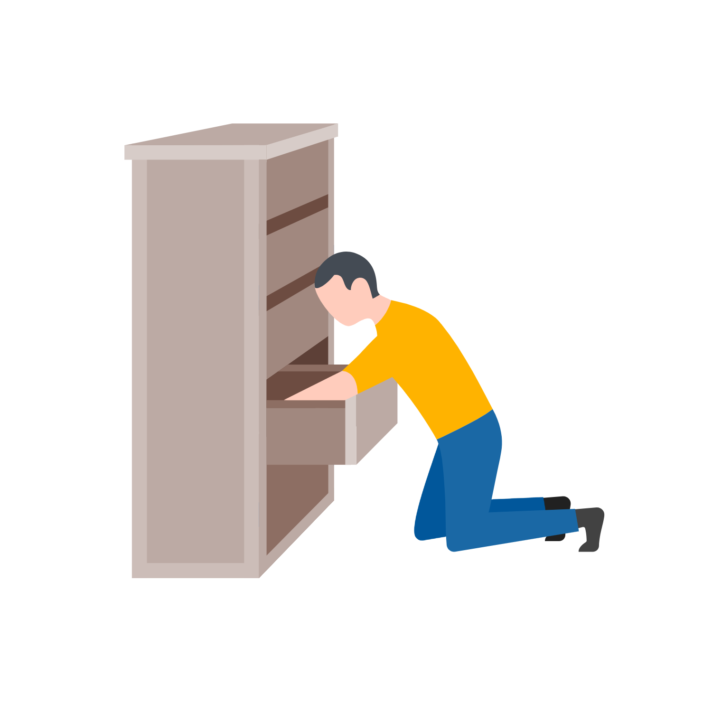

When switching to a micro-service oriented architecture versus the ol' single monolith, new problems arise. The simple job processor of the past doesn't fit in this new architecture. Jobs may not be handled by a single app instance anymore, but many. I found Bull, a Redis-based queue for Node, to cover my needs, but needed tweaks to work in this new world. Due to this module being open-source, I knew the improvements I made to it could be contributed back to the package.

## Specialized Work

<div class="Image__Small">
  
</div>

Let's say we want to do some specialized work, scanning an image to extract text for example. This is a situation where doing this work in your main app process won't make sense to most people. The needs of image processing are different than a web server and can be optimized to use a very different set of hardware like GPUs.

When image processing needs to be done, a job queue will come in handy, we can do this work in a separate process away from a user-facing interface.

- Get the image to process from the user from a web UI
- Queue a new image-processing job
- The job gets worked on
- Job results are sent back to the app

## Existing Solutions

Two popular packages in the wild that could help you do the forementioned work are [DelayedJob](https://github.com/collectiveidea/delayed_job/) and [Celery](http://www.celeryproject.org/). These allow you to manage jobs using a key-value store such as [Redis](https://redis.io/). These assume **the processing of the job and the job queue live in the same service**. This is very different than a typical microservice architecture. If you have one service performing a task, e.g. the image processor, and another service which acts as a job queue, we cannot use these types of packages without some extra work.

<div class="Image__Medium">
  
  <figcaption>Typical setup (Diagram 1)</figcaption>
</div>

versus

<div class="Image__Medium">
  
  <figcaption>Micro-services setup (Diagram 2)</figcaption>
</div>

## Searching and Searching

<div class="Image__Small">
  
</div>

I came into this situation recently and when searching for a Node.js job queue solution, I found [Bull](https://github.com/OptimalBits/bull). This package is lightning fast, built to work with Redis and has an active community. As mentioning previously, out-of-the-box this package did not support cross-service job queueing (see diagram 2).

Let's think about how we want to manage a jobs life-cycle. The documentation for Bull is quite good and they recently drew up a life-cycle diagram which will save us some time.

<div class="Image__Medium">
  
  <figcaption>Bull's Job Lifecycle <a href="https://github.com/OptimalBits/bull/blob/develop/docs/job-lifecycle.png" target="_blank">Diagram</a></figcaption>
</div>

Bull had a simple way to define the processing logic, what a job does when in the `active` queue:

```javascript
queue.process(async () => {
  // Could be image-processing from our previous example
  await doWork();
});
```

Whenever a job comes into the `waiting` queue, Bull knows how to process it and move it to the `completed` queue. Using Bull natively, it will manage all the state transitions on its own, this makes sense for apps that do the work in the same process. We need to switch to manual. You may be thinking, **"to work in this new fashion, how about we just don't define this `process` method?"**, I tried this, and it _worked!_. Forward into the weeds.

## Implementation

Our new Bull service will live in between services which can queue up jobs and ones which will do work. What we need to do now is learn **how to move jobs across queues manually and expose those methods as an API other services can use**.

Looking into the codebase, the methods `queue.add()`, `queue.getNextJob()`, `job.moveToFailed()`, `job.moveToCompleted()` are all we need. The only problem with this is that `job.moveToFailed()` and `job.moveToCompleted()` are private. It means that the authors didn't write these methods to be used publicly. This makes sense as Bull was never designed to do what we are trying to do. Looking into the Github issues in the repo, [I find someone else trying to do the same thing as us](https://github.com/OptimalBits/bull/issues/790).

> The actual implementation of our new job-queue server is fairly simple now that we have these methods. [Click here to be taken the docs I contributed back after coming up with this new pattern](https://github.com/OptimalBits/bull/blob/develop/PATTERNS.md#manually-fetching-jobs).

This is exactly what I am trying to achieve, it makes me feel better someone already thought about doing this. Before embarking on using this code in production, a great idea is to open a pull-request to [add documentation about this pattern](https://github.com/OptimalBits/bull/pull/1017/files#diff-375fc823554b090375d9c47199cb5ee2R201). Bull is a fairly active project so the maintainer or contributors could give us good insight.

## Contributing Back

<div class="Image__Small">
  
</div>

To validate our new job queue service, an addition to the reference docs <a href="https://github.com/OptimalBits/bull/pull/1017/files#diff-375fc823554b090375d9c47199cb5ee2R201" target="_blank">was added</a> to make this a known pattern in the community. This encourages usage of the feature and possibly leads to other users finding issues when using in production.

I am very happy with the outcome of the project as not only did we satisfy our requirements but it also led to me making open source contributions. This led to understanding the internals of the package and also led to myself being able to easily add features for my use case. Having an active maintainer on the project who knew the ins-and-outs also made the entire process run smoothly.
