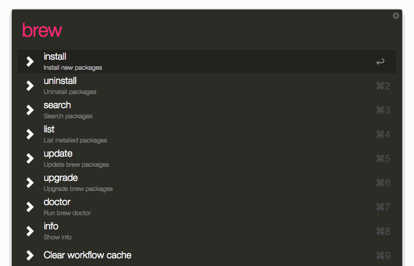
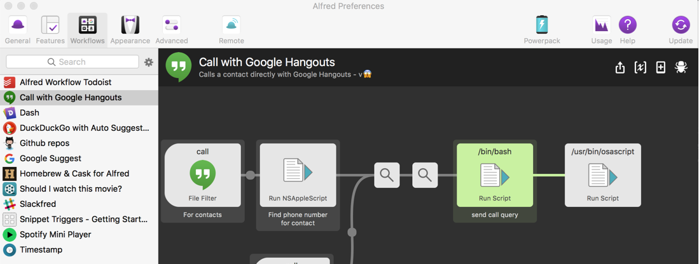
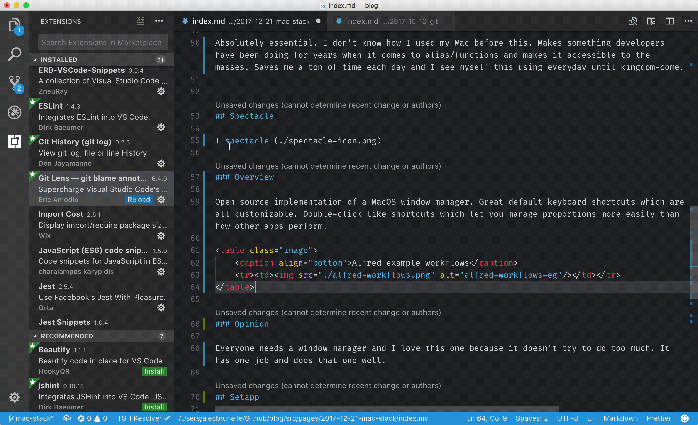
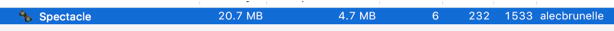

The typical situation goes as follows:

* Coworker comes to my desk to ask me a question
* Sees something radical happening on screen
* Asks why they haven't heard of the application
* Screams silently

<table class="image">
    <caption align="bottom"><strong>A porg screaming silently</strong></caption>
    <tr>
        <td style="text-align: center;">
            
        </td>
    </tr>
</table>

In lieu of this, many people are unaware of some nifty Mac applications which will make your productively skyrocket. I thought to put a collection of my top-rated apps which follow a loose criteria:

* must look amazing
* ‎must have great keyboard shortcuts
* must be hipster AF

People will complain that most of these apps function as terminal command wrappers but my brain works better with visual representations of things. Most are developer-centric but could be used by anyone.

Here we go:

## Alfred

### Overview

Ever want to create custom commands in MacOS Spotlight? You can easily create highly customizable commands yourself or access commands built by the community. For example, the Spotify, Todosit, and GitHub integrations can all cut down performing actions from several key strokes to just one.

<table class="image">
    <caption align="bottom">Downloading Postgres</caption>
    <tr><td></td></tr>
</table>

<table class="image">
    <caption align="bottom">Alfred example workflows</caption>
    <tr><td></td></tr>
</table>

In my opinion Alfred is absolutely essential. I don't know how I used my Mac before this. Makes something developers have been doing for years when it comes to alias/functions and makes it accessible to the masses. Saves me a ton of time each day and I see myself this using everyday until hell freezes over.

> Get it [here](https://www.alfredapp.com/)

## ‎Spectacle

### Overview

Open source implementation of a MacOS window manager. Great default keyboard shortcuts which are all customizable. Double-click like shortcuts which let you manage proportions more easily than how other apps perform.

<table class="image">
    <caption align="bottom">Double-clicking command-option-arrow</caption>
    <tr><td></td></tr>
</table>

Everyone needs a window manager and I love this one because it doesn't try to do too much. It has one job and does that one well. It also has a very small memory footprint which makes this app easy to recommend to anyone.

<table class="image">
    <caption align="bottom">Spectacle eg. footprint</caption>
    <tr><td></td></tr>
</table>

> Get it [here](https://www.spectacleapp.com/)

## ‎Setapp

### Overview

Apple has been doing a shit job when it comes to facilitating a good ecosystem within their own Mac App Store. A worth competitor has risen in Setapp.

One of the problems which come up when looking for quality MacOS apps is that they're hard to find and when you find them, they aren't free.  As much as I support users paying for apps, making a choice over which ones are worth your money is difficult. That's where Setapp comes in, a curated list of apps which you have access to for a small sub fee ($10) each month.

<table class="image">
    <caption align="bottom">Setapp photo apps</caption>
    <tr><td></td></tr>
</table>

I've using Setapp consistently for the past 6 months and many updates have improved both the quality and the selection of apps provided by the service. Most of the time when I want to perform a utility, they have an app here already for you to use. Never had a single problem with it and recommended for lazy people like me which don't want to go searching for apps on the web to do simple things. Fun fact, I recorded the .gifs found in this post using Gifox which came bundled in Setapp.

> Get it [here](https://setapp.com/)

### Part 2

Keep an eye out for my next article which will focus more on developer-centric apps