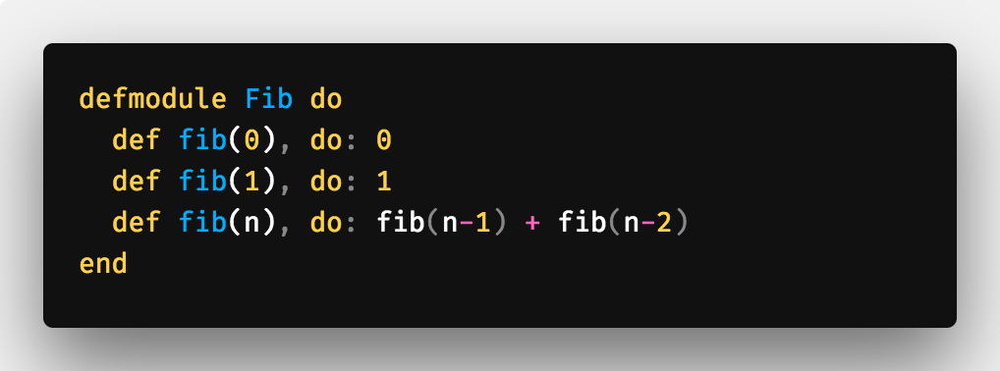
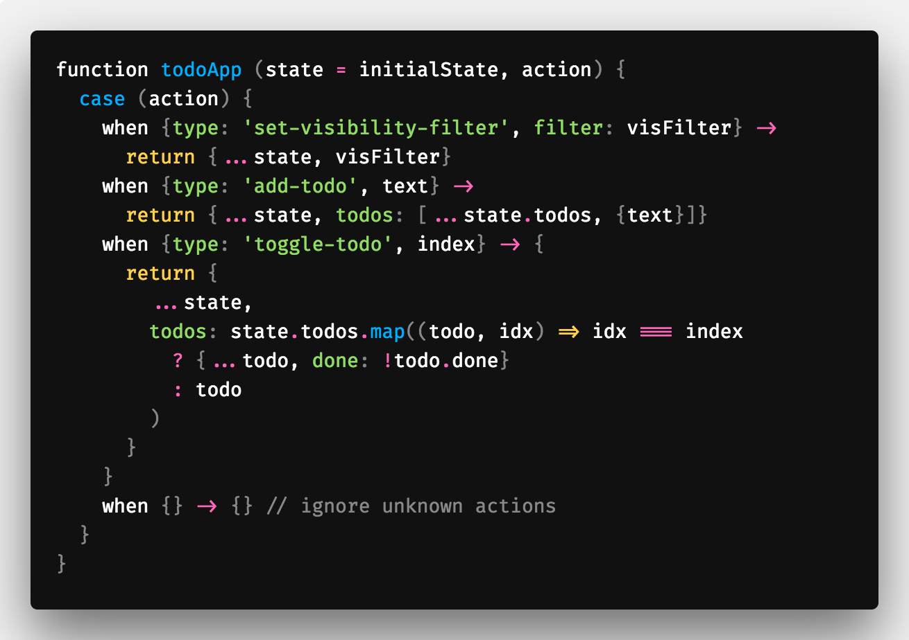

<table class="image">
    <caption align="bottom"></caption>
    <tr><td></td></tr>
</table>

After getting comfortable with a couple programming technologies, developers usually stop there; Your job and the systems you maintain may all be in one or two languages. You start using similar patterns again and again to solve the same problems. Learning a new programming language can introduce you to techniques you never would've came across using your existing technologies. It expands your toolbox when it comes to designing new systems. Imagine a carpenter being stuck to a certain set of tools for years, they would be limited in what they could build. After learning programming languages for years (school, contract-work, co-ops, etc), it's refreshing to step away from a mindset focused on getting it done as fast as I could. No timelines telling you what velocity to learn at and no peers depending on you to finish what your working on. I find that in this setting, it's easier to digest larger cognitive loads, and as Elixir was so different in many ways, I can't imagine learning it any other way.

### Beautiful Design

<table class="image">
    <caption align="bottom">E.g. of pattern matching. This and many more features of the language make it expressive and easy to read.</caption>
    <tr><td></td></tr>
</table>

### Quick Facts for the T.L.D.R. in you

- Elixir is simply syntax on top of the battle-tested VM and language, Erlang.

- The syntax is similar to Ruby so learning the syntax should be fairly easy.

- Did I mention it's FUNCTIONAL???????????????? (Pure, functional programming i.m.o. is worth the investment cognitively, [hit this link](https://medium.com/making-internets/functional-programming-elixir-pt-1-the-basics-bd3ce8d68f1b) for how Elixir utilizes it)

One of the benefits of learning a recently-created programming language is that it's built on top of existing best practices. This can happen by the creators spending time thinking about what problems other developers face regularly. "State management is hard", "It's hard to have zero time deployments of new code", "It's hard to maintain my systems", something every developer hears. Elixir wants to make these problems less hairy and does so using functional methodologies wrapped around a VM which puts distributed/concurrent programming as a first-class citizen. It does this through implementing the [OTP](https://en.wikipedia.org/wiki/Open_Telecom_Platform) protocol. Elixir for example was built by developers who saw the productivity of the Ruby syntax, the maintainability of functional programming and the scalability of Erlang. These features of the language make it very expressive, as you saw in the pattern matching example above.

<table class="image">
    <caption align="bottom">OTP in the anime-flesh</caption>
    <tr><td></td></tr>
</table>

The critic inside you will say the potential downfalls of using such a new language is that it isn't battle-tested. Usually this is a valid criticism, such is not the case for Elixir as the VM it's built on top of is hella old. The initial open-source release of Erlang was in 1998, and Ericsson was using it in-house plenty of time before that. Used by telecom networks, these were critical services which could not afford to have downtime. For example, that's how the very cool hot-code release feature came to be which enables developers to release new Erlang/Elixir code without taking down servers.

### My Experience

<table class="image">
    <caption align="bottom" style="font-style:italic;">Me reading Elixir in Action</caption>
    <tr><td></td></tr>
</table>

Last year, a coworker invited me to a bookclub he was starting, "lets learn this new language". I had heard it was the new hotness so I said, "Sure thing!". we would take a couple of hours every month to go over a chapter in the book, <a href="https://www.amazon.ca/gp/product/161729201X/ref=as_li_tl?ie=UTF8&camp=15121&creative=330641&creativeASIN=161729201X&linkCode=as2&tag=coffeedrive09-20&linkId=97d40dff77b7869475d6ee283c6501d2" style="font-style:italic;">Elixir in Action</a>. It was intimidating to say yes as everyone in the group was more senior that me but I was confident I could keep up. Out of each week came lots of great discussions and insight into topics I wasn't exposed to much before. I am appreciating my former self for saying yes as it brought concepts to my thinking I haven't gave thought to before. It helped me through Flipp's adoption of Event Driven Systems (Kafka) by exposing me to good practices when managing state between processes. Keeping processes small, pure and functional is just good-sound engineering practice and Elixir is built with that standard by default. I didn't need anything to build immediately or an assignment to finish, I learned for the joy of learning and got a lot out of it.

### Common questions

<table class="image">
    <caption align="bottom">❓</caption>
    <tr><td></td></tr>
</table>

> We are heading towards the micro-services mindset at my company, I heard Elixir is better utilized as a monolith

This is where I don't have an answer yet and through my learnings and eventual development of the language I hope to have more insight on this later in a post. Elixir (and the BEAM) is meant to be a large monotholic system which is totally against the micro-service architecture of recent years. Erlang scales horizontally extremely well so it may be a case of code bloat or organization-information-sharing that kills you in super-duper large projects.

> My team is not going to be happy that after learning 3 Javascript frameworks in the past week, they have to learn this

Once you start building things that have to scale or need to handle millions of requests, your on-call tickets increase. The reason for this is usually you can't predict traffic at that scale, push notifications go out for a new feature and everyone starts hitting your API. How do you handle this currently, with something like Node or Ruby? You just increase your box numbers and then decrease them after the load is done. This gets expensive and developers should not just be throwing money at something to solve a problem. Erlang VM processes (different than traditional processes) are a fixed size, this is **mega**. This essentially solves this problem to a degree. Knowing how much memory processes are gives you god-like abilities, the VM can tell the server it's running on how much potential memory it will use. Instead of falling over and the box restarting, you can respond to client with HTTP Status Code 429. No unexpected memory loads at 1AM waking up developers.

> Okay, this is dope, how are errors handled?

Errors are a first class citizen in Elixir. Processes are isolated so when an error is thrown, the entire app process doesn't have to dump it's stack, just the isolated process. When errors do happen, they are easier to debug as the process code is small (by Elixir convention). As processes are so small, every process gets a monitor (another OTP blessing), which can run some code when a process dies, restart the process for example.

Also it's very neat that there is a proposal for pattern matching in Javascipt. Obvious proof that everyone is drinking the ... wait for it ... Elixir.

<table class="image">
    <caption align="bottom">🚒</caption>
    <tr><td></td></tr>
</table>

#### The road forward

My plans forward is just to write more and more Elixir code to get more comfortable with it. HackerRank has Elixir as an environment so that has been a great resource for me to just practice the syntax. One of the next things I want to do is start creating something in [Phoenix](https://github.com/phoenixframework/phoenix).

## Reading resources

The book we read during the bookclub was Elixir In Action. A very good book which in details goes through the entire language and it's features. The beginning is quite slow as you start to wrap your brain around syntax but afterwards it gets super interesting.

<a target="_blank" href="https://amzn.to/2Lt7BCP">
  <table class="image">
      <caption align="bottom" style="text-decoration:underline;">Elixir In Action (Amazon Affiliate Link)</caption>
      <tr><td></td></tr>
  </table>
</a>

<a target="_blank" href="https://amzn.to/2BWNsWC">
  <table class="image">
      <caption align="bottom" style="text-decoration:underline;">The Little Elixir & OTP Guidebook (Amazon Affiliate Link)</caption>
      <tr><td></td></tr>
  </table>
</a>
